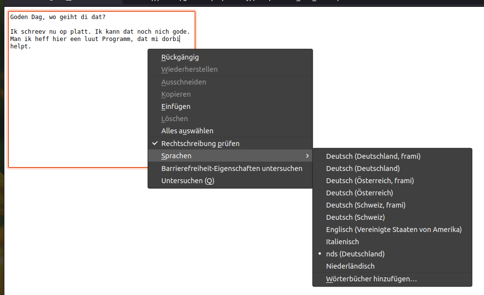

# Mozilla Add-On for low german spell check

This add-on adds low german (nds) spell check to Mozilla Firefox.

It uses LibreOffice's hunspell dictionary for low german,
which you can find [at this repository](https://github.com/tdf/dict_nds).

**Important** to this stage this repository is still experimental.

## Known issuea

When you load the add-on in Firefox, the browser will show the dictionary
in the spell checker menu, but it will not show a proper name for it.
Instead, it will just show the ISO 639-2 code `nds` for it.

This is of course a problem, because almost nobody knows the ISO 639-2 code.
So users will not be able to find the dictionary in the menu.

See the [bug report on Bugzilla](https://bugzilla.mozilla.org/show_bug.cgi?id=1764916)
for this and a screenshot of the behavior below.

