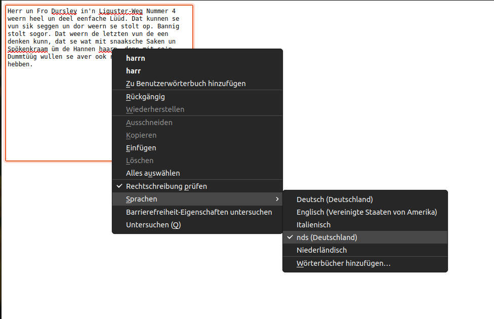

# Mozilla Add-On for low german spell check

This add-on adds low german (nds) spell check to Mozilla Firefox.

The low german language is also known under the names
*Plattdüütsch*, *Plattdeutsch*, *Nedderdüütsch*, *Niederdeutsch*,
*Niedersächsisch*, *Sächsisch* and according to the ISO 639-2 norm
it has the language code **nds**.

This add-on uses LibreOffice's hunspell dictionary for low german,
which you can find [at this repository](https://github.com/tdf/dict_nds).
Its developers did a great work in crafting this dictionary.

## Known issues

When you load the add-on in Firefox, the browser will show the dictionary
in the spell checker menu, but it will not show a proper name for it.
Instead, it will just show the ISO 639-2 code **nds** for it.

Here is a screenshot of the behavior:

This is of course a problem, because most speakers of low german do not know th
ISO 639-2 code.
Indeed the official name *Niedersächsisch* is not common in Germany.
Most people refers to low german as *Plattdeutsch*.

However, after I [reported the bug on Bugzilla](https://bugzilla.mozilla.org/show_bug.cgi?id=1764916)
the developers were not willing to add low german to Firefox's language
list. So, we will have to live with this.
